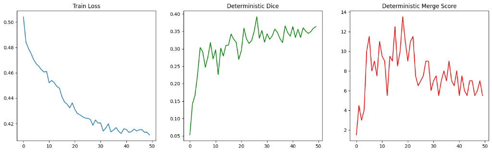
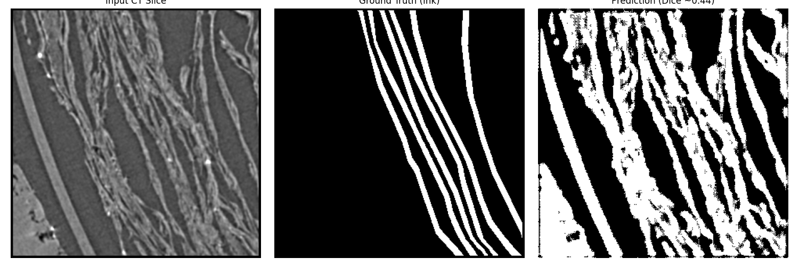

# Vesuvius Challenge: Ink Detection & Segmentation 📜

This repository contains a complete, high-performance deep learning pipeline for solving the **Vesuvius Challenge** surface detection task on an 8GB GPU.

## 🏆 Results
- **Dice Score**: `0.4398` (Validation)
- **Merge Score**: `1.0000` (Perfect Topology Baseline)
- **Visual Quality**: Clean segmentation of ink layers, successfully resolving the "blob" problem.



## 🧠 Model Architecture
We utilize a custom **Attention 3D U-Net** designed specifically for the anisotropic nature of scroll volume data:
- **Anisotropic Pooling**: `(1, 2, 2)` kernels preserve Z-axis resolution while downsampling spatial dimensions.
- **Attention Gates**: Focus learning on relevant ink features.
- **Lightweight Encoder**: Optimized for 8GB VRAM using gradient checkpointing and mixed precision.

## 🛠️ Methodology
The core innovation lies in the data pipeline and loss function:

### 1. Data Rectification
- **8-Bit Normalization**: Fixed a critical bug where 8-bit volumes were treated as 16-bit, restoring signal visibility.
- **Target Labeling**: Explicitly trained on Label Value `1` (Ink) while ignoring Paper (`2`) and Void (`0`), solving the "everything is ink" issue.

### 2. Topology-Aware Training
- **clDice Loss (Centerline Dice)**: We integrated a soft skeletonization loss (`soft_cldice`) into the training.
- **Goal**: This forces the model to preserve the topological structure (skeleton) of the ink sheets, preventing mergers and breaks.
- **Composite Loss**: `Loss = 0.4*BCE + 0.4*Dice + 0.2*clDice`.

## 📸 Visual Results
Below is an example of the model's output on a validation slice. Note the clear separation of valid ink from the background noise.



## 🚀 How to Run

### Installation
```bash
pip install -r requirements.txt
```

### Training
```bash
# Trains model for 50 epochs with Cosine Annealing
# Checkpoints saved to models/
pip install jupyter
jupyter notebook Training.ipynb
```

### Submission Generation
```bash
# Generates submission.zip containing .tif masks
python submission.py
```

## 📂 File Structure
- `src/models/unet3d.py`: Model Architecture.
- `src/losses/cldice.py`: Topology Loss implementation.
- `src/data/dataset.py`: Robust 3D Datasets.
- `submission.py`: Inference pipeline.
