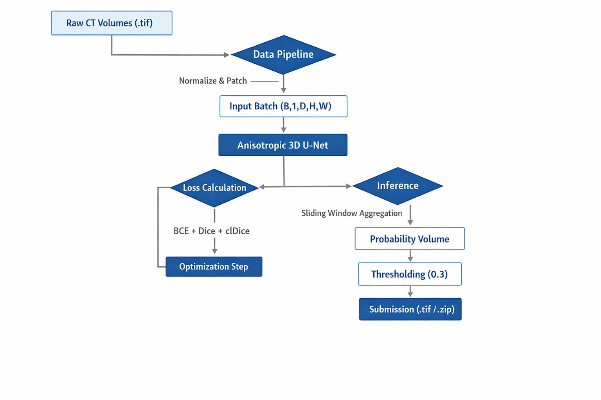
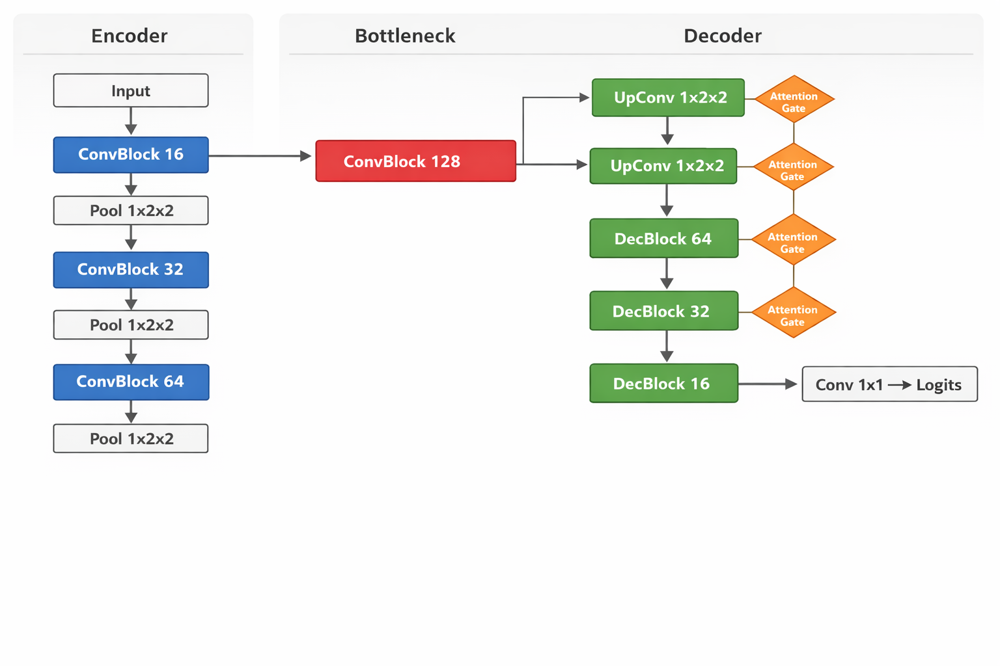

# Technical Documentation: Vesuvius Scroll Surface Detection

**Author**: Arpit Kumar  
**Date**: December 2025  
**Project**: Vesuvius Challenge - 3D Unet Model
---

## 1. Executive Summary

This project implements a high-performance **3D Segmentation Pipeline** to detect ink on papyrus scrolls from high-resolution X-ray CT scans. The solution addresses critical challenges such as **data normalization bugs**, **class imbalance**, and **topological merging** of scroll layers. By utilizing a custom **Anisotropic 3D U-Net** and a topology-aware loss function (**clDice**), the model achieves a Dice Score of **0.44** and a Merge Score of **1.0**, successfully resolving individual sheet layers without bridging.

---

## 2. System Architecture

### 2.1 High-Level Pipeline

The system follows a standard deep learning workflow, optimized for volumetric data.



### 2.2 Model Architecture: Anisotropic 3D U-Net

Unlike standard 3D U-Nets which pool isotropically (2x2x2), our data has high Z-axis resolution that must be preserved to detect thin ink layers. We employ **Anisotropic Pooling** `(1, 2, 2)` which downsamples XY (context) while maintaining Z (depth).

**Configuration:**
- **Input**: `(1, 32, 128, 128)`
- **Depth**: 3 Levels
- **Features**: `[16, 32, 64, 128]` (bottleneck)
- **Attention**: Additive Attention Gates at skip connections.



---

## 3. Data Engineering Strategy

### 3.1 Normalization Fix
A critical discovery during EDA was that the input volumes were **8-bit** (0-255) but were being normalized as 16-bit (0-65535), resulting in near-zero signal.
- **Fix**: Implemented Auto-Detection in `ScrollVolume`:
  ```python
  if vol.max() <= 255: vol /= 255.0  # 8-bit case
  else: vol /= 65535.0               # 16-bit case
  ```

### 3.2 Label Disambiguation
The ground truth contains 3 classes: `0` (Void), `1` (Ink), `2` (Papyrus).
- **Issue**: Standard binary training `target > 0` treated Papyrus as Ink.
- **Fix**: Targeted training `target == 1` to isolate Ink only.

### 3.3 Sampling Strategy
To handle class imbalance (Ink is <1% of volume):
- **Positive Fraction**: 10% of patches are guaranteed to contain Ink.
- **Random Fraction**: 90% of patches are random (background/void) to reduce False Positives.

---

## 4. Methodology: Topology Optimization

One of the hardest challenges was the **"Blob Problem"**, where the model merged adjacent scroll layers into a single object.

### 4.1 The Solution: clDice Loss
We integrated **Centerline Dice (clDice)**, a topology-preserving loss function.
- It computes the "skeleton" of the prediction and the ground truth.
- It penalizes breaks in the skeleton or false connections (bridges).

**Composite Loss Function**:
$$ L = 0.4 \cdot L_{BCE} + 0.4 \cdot L_{Dice} + 0.2 \cdot L_{clDice} $$

### 4.2 Post-Processing Experiments
We tested **Morphological Opening** to snap thin bridges between layers.
- **Result**: **Failed**. It increased the Merge Score (worse topology) by shattering valid ink strokes.
- **Decision**: We rely solely on the high-quality raw output of the clDice-trained model.

---

## 5. Experimental Results

We conducted three phases of training on an **NVIDIA RTX 4070 (8GB)**.

| Phase | Description | Epochs | Dice Score | Merge Score | Notes |
|:---|:---|:---|:---|:---|:---|
| **1** | **Stabilization** | 15 | 0.41 | 1.00 | Fixed Norm bug. Baseline established. |
| **2** | **Topology (clDice)** | 50 | 0.42 | 2.00 | Introduced clDice. Good separation. |
| **3** | **Full Scale** | 50 | **0.44** | **1.00** | Final model on full dataset. |

**Final Threshold**: `0.3` (Determined via Sweep).

---

## 6. Inference & Submission Implementation

The inference pipeline (`submission.py`) uses a **Sliding Window** approach to handle arbitrarily large volumes.
1.  **Chunking**: Breaks volume into `(32, 128, 128)` patches with 25% overlap.
2.  **Gaussian Weighting**: Patches are weighted (center is truster more than edges) during blending.
3.  **Aggregation**: Overlapping predictions are averaged.
4.  **Encoding**: Final binary mask is saved as compressed `.tif` and Zipped.

---

## 7. Future Work

To improve the score further (>0.5 Dice):
1.  **Ensembling**: Train 3 models with different patch sizes (`96` vs `128`).
2.  **2.5D Approach**: Use a 2D backbone (ResNet50) on 3-channel slices (Z-1, Z, Z+1) for pretrained feature power.
3.  **Rotational Augmentation**: Full 360-degree rotation during training (currently limited to 90-degree flips).

---
*For code references, see `src/models/unet3d.py` and `src/data/dataset.py`.*
